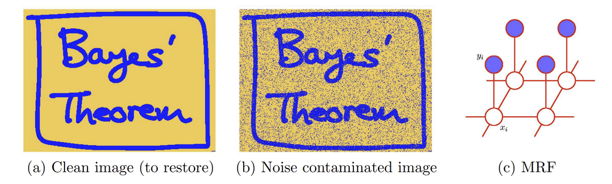

# ML Lab 501: Restoring Clean Images from Noisy Images
## Overview
In this assignment, you will clean up an image that has lost information due to noise leveraging pairwise Markov Random Fields (MRF).

**Please read through all of the files associated with this Lab Assignment before you start the assignment.**

## Problem Statement

The figure above shows (a) a clean image, (b) the same image, corrupted by noise, and (c) a pairwise MRF. There are two layers of nodes. The upper layer corresponds to values $y_i$ for pixes in the observed noisy image and the lower layer corresponds to values $x_i$ in the unknown, noise-free image.

The goal of this problem is to recover the clean image (a) from a noisy input (b). Of course, we cannot recover (a) exactly since information has been lost in the noise. The graphical model we use is a pairwise MRF as shown in (c). A pixel has four neighbors. We are going to use Markov Random Fields (MRFs) to model the distribution of natural images and restore the clean image given an noisy input image. Observed image $y_i \in \{-1,+1\}$, and $i = 1,\cdots,D$ indexes pixels in the lattice. The
original noise free image is $x_i \in \{-1, +1\}$. The noisy image $y_i$ is obtained by randomly flipping the sign of pixels with some probability (10% of pixels, in this case).

There are two types of cliques in this MRF. For $\{x_i,y_i\}$, we define the energy function as $-\eta x_i y_i\ (\eta > 0)$.  Lower energy is achieved when $x_i$ and $y_i$ have the same sign and a higher energy when they have the opposite sign. For a pair of variables $\{x_i, x_j\}$ where $i$ and $j$ are indices of neighboring pixels, we want the energy to be lower when they have the same sign than when they have opposite sign. So the energy function is $-\beta x_i j_i\ (\beta > 0)$. Lastly, we have an energy term $hx_i$ for each pixel $i$ to bias the model towards one particular sign (either $+$ or $−$).

The final energy function for the model takes the form

$E(\vec{x}\vec{y}) = h\displaystyle\sum\limits_i x_i - \beta \displaystyle\sum\limits_{\{i,j\}} x_ix_j - \eta\displaystyle\sum\limits_i x_iy_i$

which defines a joint distribution over $\vec{x}$ and $\vec{y}$ given by

$p(\vec{x},\vec{y}) = \dfrac{1}{\vec{\mathcal{Z}}}exp\{-E(\vec{x}\vec{y})\}$

Now implement Coordinate-descent algorithm as below on this:
1. Initialize $\{x_i\} (x_i = y_i)$
2. Loop over $\{x_i\}$. For each $x_i$, fix the neighborhood and see whether $−x_i$ would
decrease the energy. If so, then flip $x_i$; otherwise, continue.
3. Stop when no changes can be made for $x$.

Now make some initial guess for the parameters $h$, $\beta$, $\eta$ so that the above algorithm converges and then adjust them until you can get up to 96% recovery or better. Record your parameter values and the number of iterations when you acheived this recovery.

Save the recovered image and submit it along with your code. The clean image and noisy image are included in this repository: `./figures/Bayes.png` and `./figures/Bayes-noise.png`.

### Roadmap
Begin by running the notebook `image-preprocessing.ipynb` to generate the a workable black and white image from the given color image.

Then, clean up a noise contaminated image using parwise MRF with a cooridinate-descent algorithm in `assignment5.ipynb.`

## Goals of This Lab
We are asking you to complete this assignment because we want you to:

1. Gain experience constructing and analyzing graphical models like MRF. 
2. Continue to practice implementing machine learning algorithms from first principles (we'll need this in hardware).
3. Practice writing succinct reports with clear figures on a complex topic.

## Expectations
You should implement your solution by hand. Please do not use high-level libraries unless otherwise directed to.

All lab submissions are individual and every item you submit should be a reflection of your own work. You should have ownership over the entirety of any lab you submit in this course. While your work is your own, we understand that it can be helpful in learning machine learning to collaborate with your peers, which can range from high-level discussion of a problem to debugging. Having others look at our code encourages us to write code with readability in mind. In practice, we will never work in a silo, and being able to discuss these topics with others well is a valuable skill. When you collaborate with another student, please cite them appropriately and be respectful of sharing too much. The Academic Honor Principle applies.

We respectfully ask that in the interest in furthering your own understanding of the material, that you refrain from using generative AI to code for you. Your work should be your own and you should feel comfortable justifying each design decision you make. 

Please cite any outside sources you reference.

>[!Important]
> Finally, you will get the most out of this assignment if you give yourself time to be playful and curious in your experimentation. 

## Evaluation
You will be evaluated on the quality of your code and report.

### What to Submit
Please submit the following:

1. A brief post-lab write-up that contains the following for this assignment:

    a. Any paper design that you have.

    b. A brief description of your model/algorithm. Justify your design/selection of model parameters as appropriate.
    
    c. An evaluation of your model, including evidence as appropriate.
    
    d. A brief (couple of sentences) reflection on your take-aways from this lab exercise.